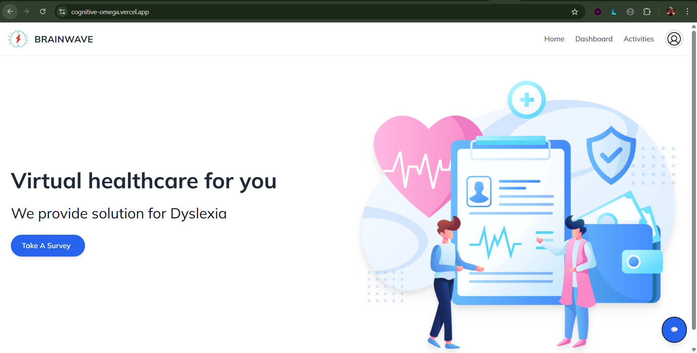
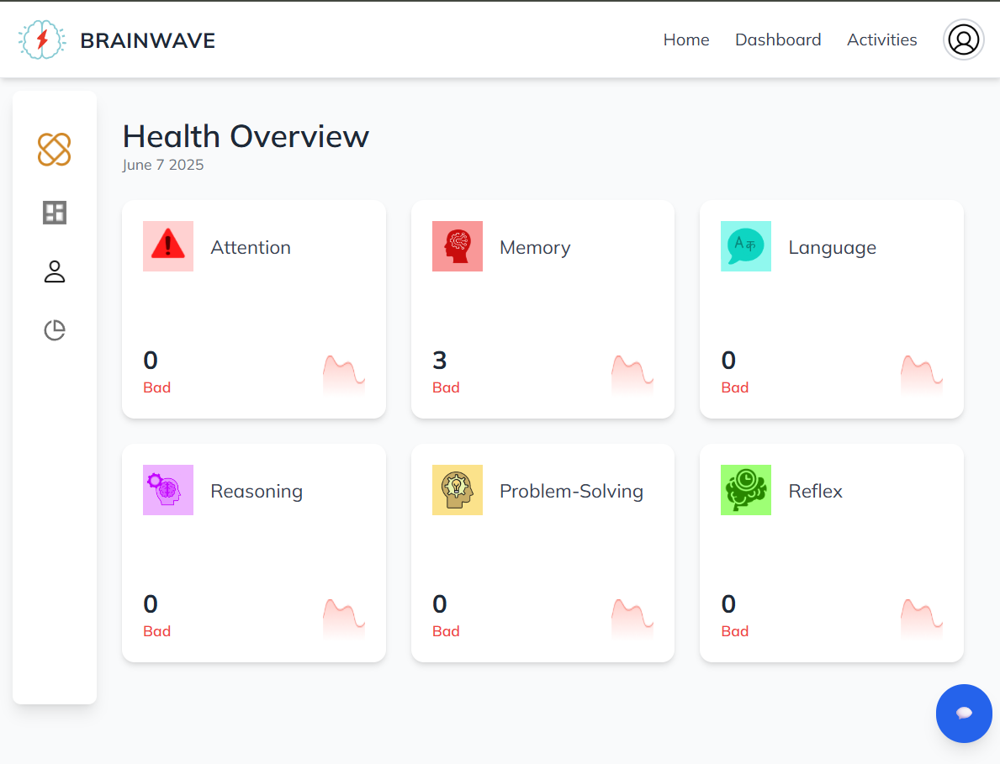
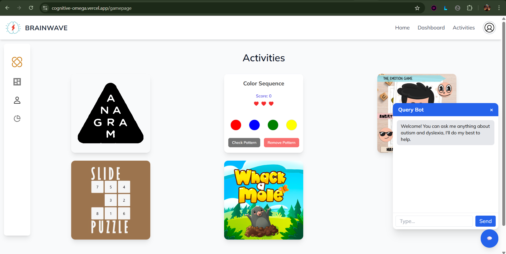

# 🧠 Cognitive Retraining Web App

A web-based platform designed to support children with cognitive disorders like **Autism** and **Dyslexia**. This application provides interactive games to improve core cognitive skills such as **attention**, **memory**, **language**, **reasoning**, and **reflexes**, along with an ML-powered early prediction tool based on user behavior and quiz responses.

---

## 📸 Screenshots

### 🏠 Home Page


### 📊 Dashboard


### 🎮 Game Interface


---

## 🚀 Live Demo

- **Frontend** (React – hosted on Vercel): [https://cognitive-omega.vercel.app](#)
- **Backend API** (Node.js – hosted on Render): [https://cognitive-backend.onrender.com](#)
- **ML Endpoint**: Deployed separately and integrated via API

---

## 🎯 Key Features

### 🕹️ Cognitive Games
- Improve **attention**, **memory**, **reflexes**, **problem-solving**, and **reasoning**
- Engaging and child-friendly interfaces

### 📋 Survey/Quiz Module
- Gathers responses from both children and parents
- Aids early detection through structured questioning

### 📊 Dynamic Dashboard
- Visual performance analysis by skill area
- Real-time feedback and progress tracking

### 🤖 Machine Learning Integration
- Predicts probability of **Dyslexia** or **Autism**
- Based on survey responses and gameplay data
- Powered by Python ML models (scikit-learn)

### 🔐 Secure Authentication
- JWT-based login and access system
- Future scope for role-based access (e.g., child, parent, admin)

---

## 🧱 Tech Stack

| Area         | Technology Used              |
|--------------|------------------------------|
| **Frontend** | React.js, Tailwindcss           |
| **Backend**  | Node.js, Express.js,           |
| **ML**       | Python, scikit-learn         |
| **Hosting**  | Vercel (Frontend), Render (Backend) |
| **Database** | MongoDB                      |

---

## 📂 Project Structure
```
/cognitive
├── frontend/   # React application (UI)
├── backend/    # Express.js API (auth, data handling)
└── ML/         # Machine learning models (deployed separately)
```


---

## 🧪 Current Status

- ✅ Functional games with scoring and UI
- ✅ Survey module connected to ML
- ✅ ML model returns early diagnosis predictions
- 🚧 Some features are placeholders (to be completed in future updates)
- 🧪 Currently in testing and enhancement (Version 1.0)

---

## 🧠 Motivation

Cognitive disorders often go **undetected in early childhood**, especially in under-resourced communities. This platform aims to:

- Provide **early screening** for Autism and Dyslexia
- **Improve core cognitive skills** through games
- Be a **free, accessible solution** for parents, schools, and clinics

---

## 📦 Setup Instructions (for Local Development)

```bash
# Clone the repository
git clone https://github.com/Guna1301/cognitive.git
cd cognitive

# Install frontend dependencies
cd frontend
npm install
npm start

# Install backend dependencies
cd ../backend
npm install
npm run dev
```
Create a .env file in the backend folder with the following:
```
PORT=5000
MONGO_URI=your_mongodb_connection_string
JWT_SECRET=your_jwt_secret
ML_API_URL=https://your-deployed-ml-api-endpoint

```
### Future Improvements
-> Admin panel to monitor users and analytics

-> Long-term user progress tracking

-> More games targeting emotional and social intelligence

-> Mobile-optimized and responsive design

-> Speech-to-text & voice interaction for accessibility

### Contributions
Contributions, suggestions, and issue reports are welcome! Feel free to fork the repo or open a pull request.
